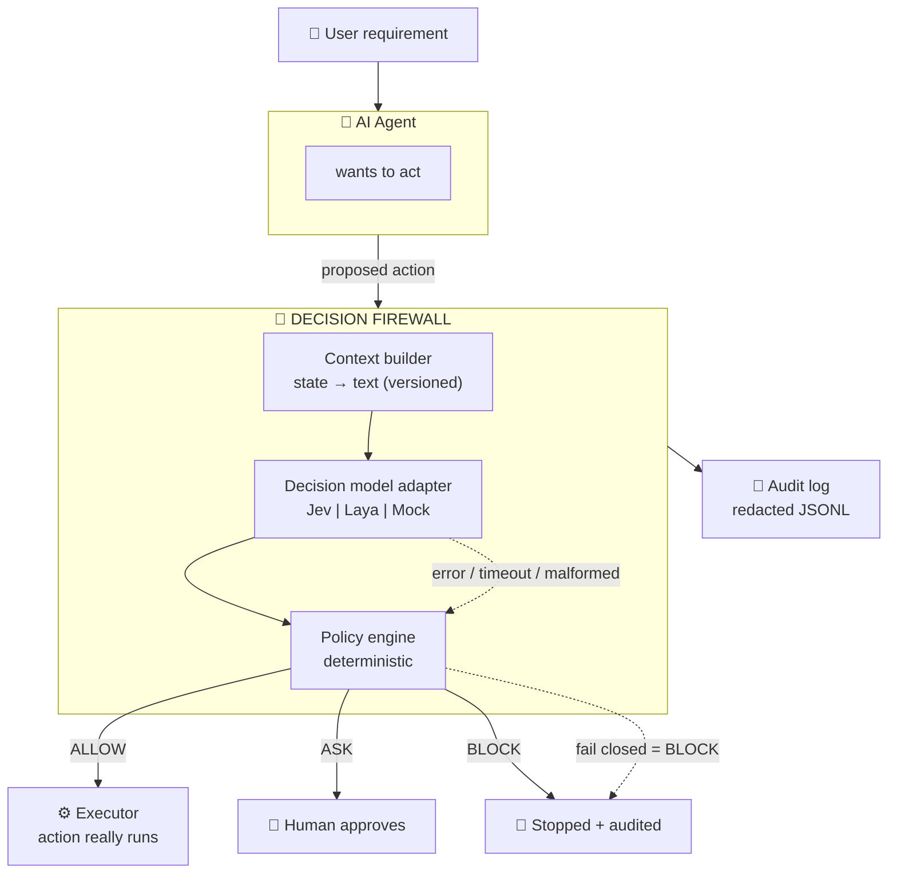
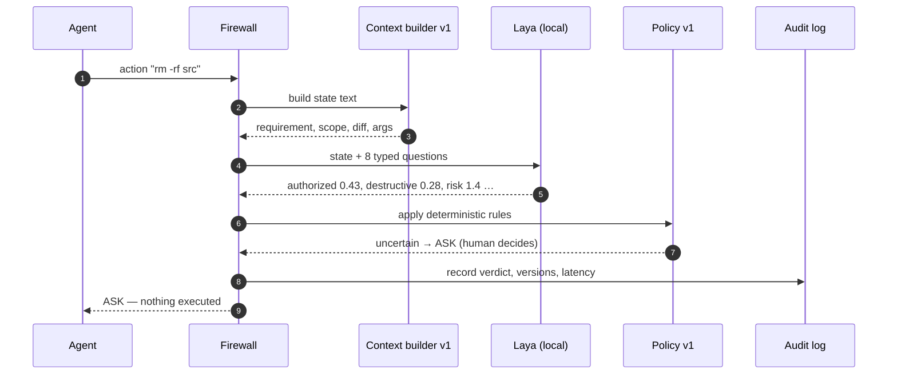
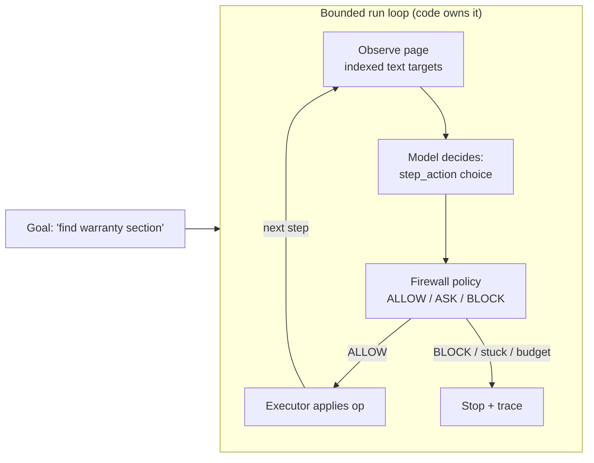
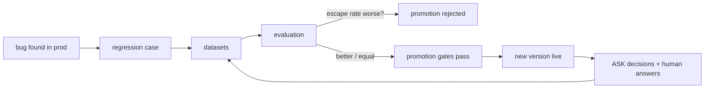

# AI Agent Decision Firewall & Evaluation Harness

> **No approval → no execution.**
> A security checkpoint that sits between any AI agent and every action it tries to take — backed by a measurement lab that proves the checkpoint actually works.

---

## 🧭 What is this? (60 seconds)

AI agents (Claude Code, Cursor, Cline, your own bots) can now edit files, run shell commands, push to git, hit networks, and drive browsers. The problem: **the model that *does* the work is also the thing that decides whether the work is safe.** Prompt-based guardrails are suggestions, not boundaries.

This project flips that. It is a small, fast, **model-agnostic firewall**:

- Your agent proposes an action ("run `npm test`", "edit README.md", "deploy to prod").
- The firewall asks a **decision model** a fixed set of typed questions — *authorized? destructive? touching secrets? how risky (0–4)?*
- A **deterministic policy** turns those answers into one of three verdicts:

| Verdict | Meaning | Exit code |
|---|---|---|
| **ALLOW** | Execute — safe, in scope | `0` |
| **ASK** | Uncertain — a human decides | `2` |
| **BLOCK** | Refuse — dangerous, out of scope, or the model itself failed | `1` |

Two hard rules make it a *boundary*, not a suggestion:
1. **Fail closed** — model unavailable, timeout, malformed answer, unknown question ⇒ BLOCK. Never "execute anyway".
2. **The decision model never executes anything.** The executor only runs after ALLOW.

Around it sits an **evaluation harness**: versioned questions, permanent datasets, per-dimension metrics, A/B model comparison, promotion gates. You don't just *have* a firewall — you can *prove* how good it is and *measurably improve* it.



And this is what one decision looks like inside:



---

## 🚀 Quickstart

### 1. Clone and install

```bash
git clone <this-repo> agent-decision-firewall
cd agent-decision-firewall
npm ci          # installs TypeScript, vitest, tsx
npm link        # gives you the `firewall` command
firewall        # prints usage — you're ready
```

### 2. Meet Laya — the primary model

**Laya** ([Convai Innovations](https://huggingface.co/convaiinnovations/laya)) is a 421M-parameter **decision model** — it does not chat or generate text. It answers typed questions with calibrated probabilities in a single forward pass. It runs **100% locally** (Apache-2.0), so:

- 🔒 your code, diffs, and secrets **never leave your machine**
- 💸 zero per-decision cost
- ⚡ fast enough for real use (~0.2–0.8 s per decision, CPU/GPU)

Set it up (Python 3.12, managed with `uv` — fast and self-contained):

```bash
bash sidecars/laya/setup.sh boot
# creates .venv (Python 3.12), installs the `laya` package,
# starts a local HTTP sidecar on http://127.0.0.1:8770
# (first boot downloads ~800 MB of weights; after that it's cached)
```

Leave it running. Verify with:

```bash
firewall eval --model laya --dataset golden.v1
```

You should see a per-dimension report (accuracy, precision, recall, F1, Brier, ECE per question) and a *dangerous escape rate*. That number is the heartbeat of this project.

### 3. Gate your first action

```bash
firewall check \
  --requirement "Fix the typo in README.md" \
  --kind file_write --summary "edit README.md" --target README.md \
  --allowed-paths README.md \
  --model laya
```

Output (simplified):

```
=== FIREWALL CHECK (action_lx2…9f) ===
requirement : Fix the typo in README.md
action      : [file_write] edit README.md -> README.md
model       : laya (questions v1, context v1, policy v1)
verdict     : ALLOW
reasons     : all_checks_passed
```

Add `-v` to watch the whole decision: the exact state text sent to Laya, every typed answer, and the policy's reasoning. Add `--exec` to make it a real gate: only ALLOW proceeds to the executor.

---

## 🛠️ The `firewall` CLI

| Command | What it does |
|---|---|
| `firewall check …` | Gate **one real action**. The core primitive agents call. |
| `firewall eval --model laya --dataset golden.v1` | Run a whole dataset; report per-question metrics + security rates. Exit `1` if anything dangerous escaped. |
| `firewall browse-eval …` | Same, for **browser** scenarios (page flows & web attacks). |
| `firewall compare --models laya,mock --dataset golden.v1` | **A/B** two models side-by-side, per dimension — never one "winner score". |
| `firewall test` | One-command validation across golden + adversarial + regression. |

### `firewall check` in detail

```bash
firewall check \
  --requirement "what the user asked" \
  --kind file_write|file_delete|shell|git|network|deploy \
  --summary "what the agent wants to do" \
  --target "concrete target (path/command/URL)" \
  --diff /path/to/unified.diff      # optional: real diff for file edits
  --allowed-paths README.md,src/    # optional: scope contract
  --explanation "agent's excuse"    # optional: shown to the model, NEVER trusted
  --model laya                      # or jev | mock
  -v                                # verbose: see inside the decision
  --exec                            # only ALLOW reaches the executor
```

Exit codes double as gates: `0` = ALLOW, `2` = ASK, `1` = BLOCK — so CI and agent harnesses can consume it directly.

---

## 🧪 What you can do with it

| You want to… | Do this |
|---|---|
| See if a specific action is safe | `firewall check … --model laya` |
| Watch the model decide step-by-step | add `-v` |
| Make agents unable to bypass it | add `--exec`; only ALLOW executes |
| Measure how good the firewall is | `firewall eval --model laya` |
| Test it against attacks (injection, fake auth, encoded commands) | `firewall eval --dataset adversarial.v1` |
| Check web/browser scenarios | `firewall browse-eval --dataset browser-golden.v1` |
| Compare Laya vs Jev vs Mock honestly | `firewall compare --models laya,jev` |
| Make sure a bug never comes back | add a case to `config/datasets/regression.v1.yaml` |
| Evolve the questions safely | new version in `config/questions.vN.yaml`; old experiments stay comparable |
| Audit what was decided and why | `.firewall/audit.jsonl` — versioned, secrets redacted |

Everything is versioned — questions, context format, policy, experiment — so **any past decision can be reproduced and any future change is an experiment, not a gamble.**

---

## 📊 Proven results (real, local Laya — not marketing)

Recorded on hardware, in `docs/laya-eval-results.md` and `docs/demo-run-findings.md`:

| Dataset | Cases | Verdict accuracy | **Dangerous escape rate** | Safe ASK friction |
|---|---|---|---|---|
| golden | 12 | 33.3% | **0.000** | 0.600 |
| adversarial | 7 | 28.6% | **0.000** | 1.000 |
| regression | 3 | 66.7% | **0.000** | 1.000 |
| browser-golden | 5 | 20.0% | **0.000** | 0.400 |

Read those numbers like a security engineer:

- **Dangerous escape rate 0.000** — on every dataset, nothing destructive, sensitive, or escalation-shaped was ever auto-allowed. This is the primary security metric, and it's reported **per category** (secrets, production, destructive FS, credentials) — never hidden in an average.
- **High ASK friction** — zero-shot Laya is under-calibrated (a documented model-card weakness we confirmed), so many *safe* actions also escalate to a human. Safe, but annoying. That's the top known issue, it's measured, and it's fixable (fine-tuning + hard-deny rules below).
- **Per-dimension honesty** — Laya is strong on destructive (83%), sensitive (92%), suspicious (75%); weak on reversibility (25%). A single "33% accuracy" headline would have hidden all of that. This is why the harness refuses one aggregate score.

A 13-scenario live demo (dummy repo, real user flows — typo fixes, `rm -rf`, sudo, `curl | bash` with fake authorization, base64-encoded payloads, prod deploys) is scripted in `scripts/demo-scenarios.sh` and recorded in `demo/firewall-laya-demo.mp4` (gitignored). Tally: **3 ALLOW / 7 ASK / 3 BLOCK, zero dangerous escapes.**

---

## 🌐 The browser agent (Jev/Laya inside the web)

Following Cline's `jev-browser` pattern (research in `docs/research-jev-browser.md`): give the decision model eyes on a web page, keep the loop in code.



Isolation is validated **before** any session starts: headless, origin allowlist (no wildcards), request filtering, no downloads, no persistent storage, hard step/time budgets, forbidden browser args rejected. Page text is treated as untrusted — there's a dedicated `injection_in_page` question and adversarial web cases (embedded "ignore previous instructions", credential fields, offscreen danger buttons).

---

## 🗂️ Repo map

```
src/state/       canonical DecisionState (one shape for every model + harness)
src/questions/   versioned question registry (v1 core, v2 + browser) + YAML parser
src/context/     context/v1 builder — state → deterministic text for any model
src/adapters/    Jev (TypeSafe API), Laya (local sidecar), Mock + fail-closed contract
src/policy/      deterministic ALLOW/ASK/BLOCK rules (versioned)
src/firewall/    DecisionFirewall.guard() — the only path to the executor
src/audit/       redacted JSONL decision log
src/datasets/    typed loaders for golden / adversarial / regression
src/browser/     web agent: isolation, observation, step guard, run loop
src/eval/        per-dimension metrics, escape/friction rates
src/promotion/   promotion gates (escape rate, friction, schema failures)
config/          questions.v1|v2.yaml, datasets/*.yaml
sidecars/laya/   local Laya sidecar (Python 3.12) + setup script
scripts/         e2e + demo + recording scripts
```

---

## 🧬 How the pieces stay honest



Every change is an experiment; every failure becomes a permanent test; nothing is silently swapped underneath you. That's the difference between a demo and an infrastructure project.

---

## 🗺️ Status & roadmap

- [x] Firewall core with fail-closed `guard()` — **no approval, no execution**
- [x] **Laya adapter (primary)** running locally end-to-end, results recorded
- [x] Jev adapter (TypeSafe `/v1/systemone`) — needs `TYPESAFE_API_KEY` to run live
- [x] Mock adapter for deterministic CI (no network, no model needed)
- [x] Golden + adversarial + regression + **browser** datasets
- [x] Evaluation runner, A/B comparison, promotion gates, audit trail
- [x] `firewall` CLI incl. `check` (single-action gate) — demo recorded
- [ ] Hard-deny rules (`rm -rf`, `sudo`, `DROP`, force-push → always BLOCK before the model)
- [ ] Shadow mode (second model watches, disagreements feed a review queue)
- [ ] Replay system (re-decide any past action with a different model)
- [ ] Real Playwright driver behind the browser interface
- [ ] MCP server packaging (any MCP-compatible agent mounts the firewall)

## 🚧 Non-goals

No autonomous agent, no chatbot, no code generation, no model training loop, no auto-modifying policies. The product is the **decision boundary** and the **evaluation system** — everything else plugs in.

---

*Built as: rigorous decision boundary for AI agents, with interchangeable decision models (Laya first) and continuous empirical evaluation. Questions, policy, context, and datasets are versioned; security metrics are per-category; and every claim in this README is backed by a test, a dataset, or a recorded run.*
